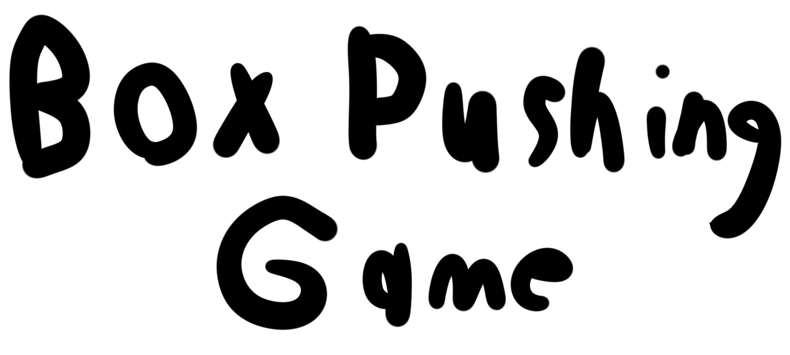

The source code to the gameplay and engine behind Box Pushing Game.

This game is published at https://jakes1403.itch.io/boxpushinggame

Donate there to support the game!

# About
Box Pushing Game was a project I took on the side to learn C++ and how to make game engines.

Most of this code is years old and there are private versions of this repo with way better code, I just havent gone around to putting them out and documenting them yet.

It is a game with a very straightforward title where you push boxes into holes. Nothing more to it than that. Its got decent art, shader effects, and custom lighting. I haven't gotten around to music but then again this is a very old project.

| Screenshots |
|:--:| 
|  |
|  |

## Supported Platforms
* Microsoft Windows 64 bit
* Linux (not buildable yet but soon)
* Sony PSP (The one from *2005*. Only works in an emulator currently)
* HTML5 (Runs with emscripten)

# About the "Engine"
Thruster (the name for the driver code of the game) is a library I created to make the creation of this game easier.

It works more as a software framework instead of an engine, and enables cross platform support easily

# Building

Make sure CMake, SDL2, and SDl2-mixer are installed.

If using the OpenGL build, make sure your system is capable of running OpenGL.

## Windows

Clone the repo

```
git clone https://github.com/jakes1403/Box-Pushing-Game.git
cd Box-Pushing-Game
```

Initialize and pull the dependencies

```
git submodule update --init --recursive
```

Make the build directory

```
mkdir build
cd build
```

Set up the build files

```
cmake -DSDL2MAIN_LIBRARY="PATH_TO_SDL2main.lib_HERE" -DSDL2_LIBRARY="PATH_TO_SDL2.lib_HERE" -DSDL2_INCLUDE_DIR="PATH_TO_SDL2_HEADERS_HERE" -DSDL2_MIXER_LIBRARY="PATH_TO_SDL2_mixer.lib_HERE" -DSDL2_MIXER_INCLUDE_DIR="PATH_TO_SDL2_MIXER_HEADERS_HERE" ..
```

Build the game

```
cmake --build . --config Release
```

## Linux

Clone the repo

```
git clone https://github.com/jakes1403/Box-Pushing-Game.git
cd Box-Pushing-Game
```

Initialize and pull the dependencies

```
git submodule update --init --recursive
```

Make the build directory

```
mkdir build
cd build
```

Set up the build files

```
cmake ..
```

Build the game

```
cmake --build . --config Release
```

# Running

In order to run the game, obtain a copy of the game assets. You can get them by downloading a release of the game at itch.io for an optional donation

You should have a file named assets.tpak

Place this file in the same directory as your BoxPushingGame executable and run it!

If the game throws an error about missing DLLs, make sure you have copied your SDL2.dll, SDL2_mixer.dll, and chipmunk.dll files from your build/library directories

Your binary directory should look like this:

```
assets.tpak
<game executable>
<DLLs if on windows>
```

*Copyright (C) 2019-2021 Jacob Allen*
